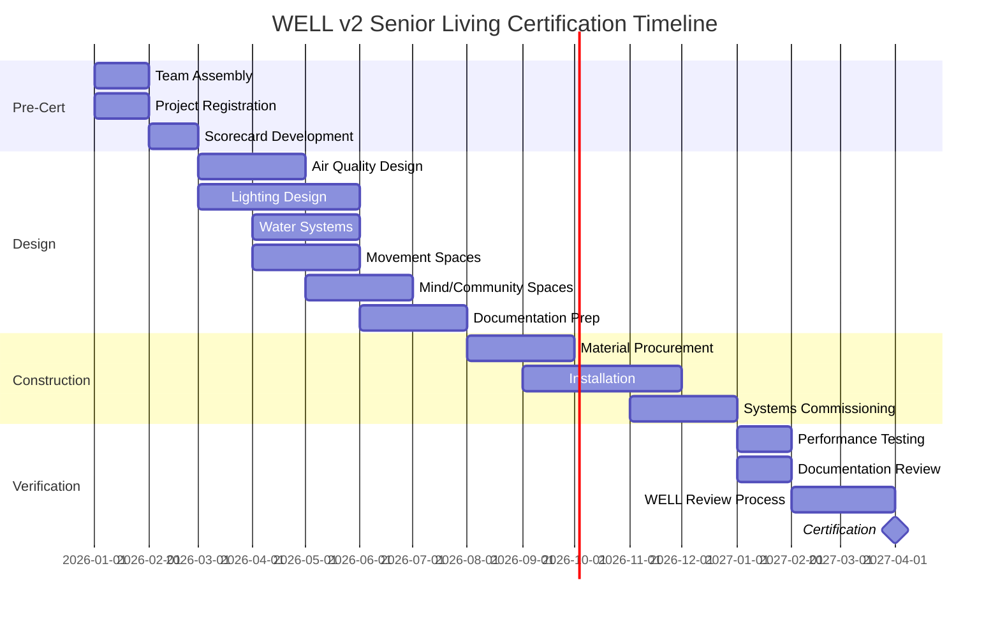

# WELL Building Standard v2
## Interactive Implementation Guide for Senior Living

---

# 🌟 Part 1: WELL v2 Concepts Overview

```
┌─────────────────────────────────────────────────────────────────────────────┐
│                         WELL BUILDING STANDARD v2                           │
│                     10 Concepts for Human Health                            │
├─────────────────────────────────────────────────────────────────────────────┤
│                                                                             │
│   ┌──────────┐    ┌──────────┐    ┌──────────┐    ┌──────────┐            │
│   │   💨     │    │   💧     │    │   🥗     │    │   💡     │            │
│   │   AIR    │    │  WATER   │    │NOURISHMENT│   │  LIGHT   │            │
│   │   A01-A08│    │  W01-W07 │    │  N01-N13 │    │  L01-L08 │            │
│   └──────────┘    └──────────┘    └──────────┘    └──────────┘            │
│                                                                             │
│   ┌──────────┐    ┌──────────┐    ┌──────────┐    ┌──────────┐            │
│   │   🚶     │    │   🌡️     │    │   🔇     │    │   🧱     │            │
│   │ MOVEMENT │    │ THERMAL  │    │  SOUND   │    │ MATERIALS│            │
│   │  V01-V10 │    │  T01-T06 │    │  S01-S05 │    │  X01-X12 │            │
│   └──────────┘    └──────────┘    └──────────┘    └──────────┘            │
│                                                                             │
│   ┌──────────┐    ┌──────────┐                                             │
│   │   🧠     │    │   👥     │                                             │
│   │   MIND   │    │ COMMUNITY│                                             │
│   │  M01-M12│    │  C01-C10 │                                             │
│   └──────────┘    └──────────┘                                             │
│                                                                             │
└─────────────────────────────────────────────────────────────────────────────┘
```

## Concept Quick Reference

| Concept | Focus Area | Senior Living Relevance | Key Features |
|---------|-----------|------------------------|--------------|
| 💨 **Air** | Indoor air quality | Respiratory health, infection control | A01-A08 |
| 💧 **Water** | Water quality & access | Hydration, medication administration | W01-W07 |
| 🥗 **Nourishment** | Healthy food environment | Nutrition, dining experience | N01-N13 |
| 💡 **Light** | Illumination & circadian | Sleep, fall prevention, mood | L01-L08 |
| 🚶 **Movement** | Physical activity | Mobility, independence, falls | V01-V10 |
| 🌡️ **Thermal Comfort** | Temperature & humidity | Comfort, medication storage | T01-T06 |
| 🔇 **Sound** | Acoustic comfort | Hearing, agitation, privacy | S01-S05 |
| 🧱 **Materials** | Safe materials | Chemical exposure, allergies | X01-X12 |
| 🧠 **Mind** | Mental health | Depression, anxiety, cognitive health | M01-M12 |
| 👥 **Community** | Social connection | Isolation, purpose, engagement | C01-C10 |

---

# ✅ Part 2: Senior Living Implementation Checklist

## Phase 1: Pre-Certification (Months 1-2)

### 🎯 Step 1: Project Kickoff
- [ ] **Assemble WELL Team**
  - [ ] Executive sponsor (VP of Operations or higher)
  - [ ] Facilities manager
  - [ ] Wellness director
  - [ ] IT lead (for sensor integration)
  - [ ] Architect/designer (if new construction)

- [ ] **Define Project Scope**
  - [ ] Select building/floor for certification
  - [ ] Choose certification type: WELL Core (minimum) or WELL Certification (full)
  - [ ] Set target level: Bronze, Silver, Gold, or Platinum
  - [ ] Establish budget: $15K-75K depending on sq ft

- [ ] **Register Project**
  - [ ] Create account at wellcertified.com
  - [ ] Pay enrollment fee: $3,000
  - [ ] Submit project details
  - [ ] Receive WELL Coaching assignment

> 💡 **Why This Matters for Seniors:** WELL-certified facilities see 12% higher occupancy rates. Families actively seek wellness-focused communities.

---

### 📋 Step 2: Scorecard Development
- [ ] **Complete WELL v2 Scorecard**
  - [ ] Review all 10 concepts
  - [ ] Select minimum required features per concept
  - [ ] Add optional features for higher certification levels
  - [ ] Prioritize senior-living-specific features:
    - A01: Air Quality Standards (critical for respiratory health)
    - L03: Circadian Lighting Design (falls, sleep, sundowning)
    - V04: Active Transportation (mobility)
    - M05: Mental Health Support (depression screening)

- [ ] **Gap Analysis**
  - [ ] Compare current state to WELL requirements
  - [ ] Identify quick wins vs. major investments
  - [ ] Create feature implementation timeline

- [ ] **Budget Planning**
  - [ ] Program fee: $0.08-0.16/sq ft
  - [ ] Performance testing: $5K-15K
  - [ ] Consultant (optional): $10K-30K
  - [ ] Improvement costs: varies by gaps identified

---

## Phase 2: Design Phase (Months 3-8)

### 💨 Air Quality (Features A01-A08)
- [ ] **A01: Air Quality Standards**
  - [ ] Specify low-VOC paints, adhesives, sealants
  - [ ] Require GREENGUARD Gold certified furniture
  - [ ] Design dedicated outdoor air intakes away from pollutants
  - [ ] Plan for MERV 13+ filtration
  - [ ] **💰 Estimated Cost:** $5-15/sq ft premium

- [ ] **A03: Ventilation Effectiveness**
  - [ ] Design HVAC for 30% above ASHRAE minimums
  - [ ] Include operable windows where possible
  - [ ] Plan for CO2 monitoring in common areas
  - [ ] **Why for Seniors:** Reduces respiratory infections by 25-40%

- [ ] **A05: Air Filtration**
  - [ ] Specify HEPA or high-MERV filters
  - [ ] Design filter change protocols
  - [ ] Plan for portable air cleaners in high-risk areas
  - [ ] **💰 Estimated Cost:** $2-5/sq ft

---

### 💧 Water Quality (Features W01-W07)
- [ ] **W01: Water Quality Standards**
  - [ ] Test source water for contaminants
  - [ ] Specify filtration systems if needed
  - [ ] Plan for lead testing in older buildings
  - [ ] **Why for Seniors:** Medication interactions with water contaminants

- [ ] **W02: Drinking Water Promotion**
  - [ ] Design hydration stations on every floor
  - [ ] Locate within 100ft of all regularly occupied areas
  - [ ] Plan for filtered, chilled options
  - [ ] **💰 Estimated Cost:** $500-1,500 per station

---

### 💡 Lighting (Features L01-L08)
- [ ] **L01: Light Exposure**
  - [ ] Design for minimum 21 footcandles at workstations
  - [ ] Specify high-CRI (90+) lighting
  - [ ] Plan for daylighting in common areas
  - [ ] **Why for Seniors:** Poor lighting = 3x fall risk

- [ ] **L03: Circadian Lighting Design** ⭐ CRITICAL
  - [ ] Specify tunable white lighting (2700K-6500K)
  - [ ] Program morning energizing light (cool/bright)
  - [ ] Program evening wind-down light (warm/dim)
  - [ ] Automate transitions or train staff
  - [ ] **💰 Estimated Cost:** $15-30/fixture premium
  - [ ] **Why for Seniors:** Reduces sundowning by 30%, improves sleep

- [ ] **L04: Glare Control**
  - [ ] Specify matte finishes on floors
  - [ ] Design window treatments for glare reduction
  - [ ] Plan task lighting for reading areas
  - [ ] **Why for Seniors:** Glare = disorientation = falls

---

### 🚶 Movement (Features V01-V10)
- [ ] **V04: Active Transportation**
  - [ ] Design wide corridors (6+ feet)
  - [ ] Include continuous handrails both sides
  - [ ] Plan for rest stops every 100 feet
  - [ ] Specify non-slip flooring
  - [ ] **Why for Seniors:** Encourages independence, prevents deconditioning

- [ ] **V06: Movement Network**
  - [ ] Design visible, engaging walking paths
  - [ ] Include destination points (garden, cafe, library)
  - [ ] Plan for both indoor and outdoor options
  - [ ] **💰 Estimated Cost:** Varies by design

---

### 🌡️ Thermal Comfort (Features T01-T06)
- [ ] **T01: Thermal Performance**
  - [ ] Design for 68-74°F range
  - [ ] Include individual room controls where possible
  - [ ] Plan for humidity control (30-60%)
  - [ ] **Why for Seniors:** Poor temp control affects medication efficacy

---

### 🔇 Sound (Features S01-S05)
- [ ] **S01: Sound Mapping**
  - [ ] Design for <45 dB in sleeping areas
  - [ ] Specify sound-absorbing materials
  - [ ] Plan for acoustic privacy in care areas
  - [ ] **Why for Seniors:** Noise = agitation in dementia care

---

### 🧠 Mind (Features M01-M12)
- [ ] **M05: Mental Health Support** ⭐ CRITICAL
  - [ ] Design quiet reflection spaces
  - [ ] Plan for mental health screening protocols
  - [ ] Include access to nature/biophilic design
  - [ ] **Why for Seniors:** 20% of seniors experience depression

- [ ] **M08: Restorative Spaces**
  - [ ] Design indoor gardens or atriums
  - [ ] Plan for outdoor access from all floors
  - [ ] Include diverse seating options
  - [ ] **💰 Estimated Cost:** $50-200/sq ft for dedicated spaces

---

### 👥 Community (Features C01-C10)
- [ ] **C01: Community Garden**
  - [ ] Design accessible raised beds
  - [ ] Plan for therapeutic horticulture programs
  - [ ] Include shaded seating
  - [ ] **Why for Seniors:** Purpose, social connection, physical activity

- [ ] **C05: Social Equity**
  - [ ] Design inclusive spaces for all mobility levels
  - [ ] Plan for intergenerational programming
  - [ ] Include diverse cultural considerations

---

## Phase 3: Construction/Renovation (Months 9-14)

### 🔨 Implementation
- [ ] **Material Verification**
  - [ ] Collect VOC documentation for all finishes
  - [ ] Verify GREENGUARD Gold certifications
  - [ ] Document chain of custody for materials
  - [ ] Photograph installation for WELL documentation

- [ ] **System Commissioning**
  - [ ] Commission HVAC systems
  - [ ] Test lighting controls and programming
  - [ ] Verify water filtration performance
  - [ ] Calibrate all sensors

- [ ] **Documentation Upload**
  - [ ] Upload material certificates to WELL portal
  - [ ] Submit annotated drawings
  - [ ] Provide equipment cut sheets
  - [ ] Submit operations protocols

---

## Phase 4: Operations (Ongoing)

### 📊 Monitoring & Maintenance
- [ ] **Daily**
  - [ ] Check air quality monitors
  - [ ] Verify water station cleanliness
  - [ ] Review circadian lighting operation
  - [ ] Inspect common area cleanliness

- [ ] **Weekly**
  - [ ] Test emergency lighting
  - [ ] Check HVAC filters
  - [ ] Verify thermal comfort in resident rooms
  - [ ] Review movement space usage

- [ ] **Monthly**
  - [ ] Calibrate IEQ sensors
  - [ ] Test water quality
  - [ ] Inspect materials for wear/damage
  - [ ] Review WELL performance dashboard

- [ ] **Annually**
  - [ ] WELL performance verification
  - [ ] Recertification documentation
  - [ ] Staff WELL training refreshers
  - [ ] Resident satisfaction survey

---

# 🔗 Part 3: WELL Features → Senior Care Outcomes Matrix

| WELL Feature | Health Outcome | Senior Living Impact | Measurement |
|--------------|----------------|---------------------|-------------|
| **A01-A08: Air Quality** | Respiratory health | ↓ 25-40% respiratory infections | Air quality monitoring |
| **L03: Circadian Lighting** | Sleep quality | ↓ 30% sundowning incidents | Sleep logs, incident reports |
| **L01/L04: Lighting Design** | Fall prevention | ↓ 20% falls from poor visibility | Fall incident data |
| **V04: Active Transportation** | Mobility | ↑ 15% independent mobility | Mobility assessments |
| **T01-T06: Thermal Comfort** | Medication efficacy | ↓ 10% med-related issues | Pharmacy reports |
| **S01-S05: Acoustic Comfort** | Agitation/behavior | ↓ 25% behavioral incidents | Behavioral logs |
| **M05/M08: Mental Health** | Depression/anxiety | ↓ 15% mental health diagnoses | Health records |
| **C01-C10: Community** | Social isolation | ↑ 40% social engagement | Activity participation |

---

# 📅 Part 4: Implementation Timeline (Gantt Chart)



---

## 📋 Quick-Start Checklist (Printable)

### This Week:
- [ ] Get executive buy-in
- [ ] Review this guide with facilities team
- [ ] Register at wellcertified.com

### This Month:
- [ ] Assemble WELL team
- [ ] Complete initial scorecard
- [ ] Identify quick wins

### This Quarter:
- [ ] Begin design phase
- [ ] Select priority features
- [ ] Budget for improvements

---

*Guide Version: WELL v2 Q1 2026 | For questions: wellcertified.com/support*
